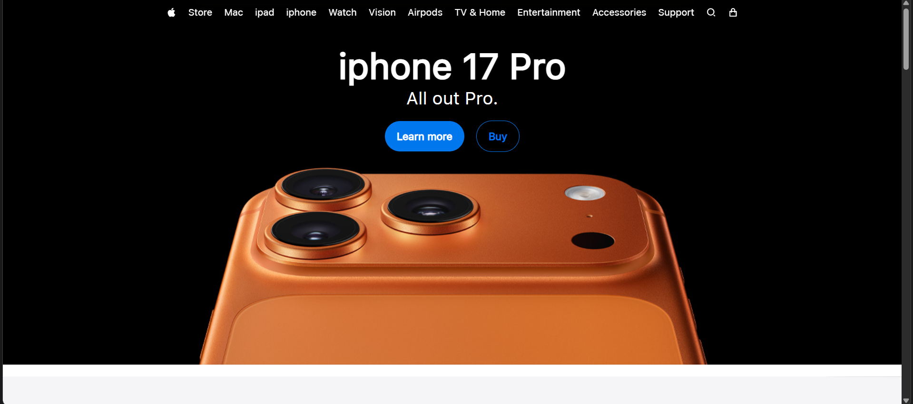

# 🍏 Apple.com Clone

A fully responsive **Apple.com clone** built using **HTML & CSS**.  
This project recreates the clean and minimal design of Apple's official website, focusing on layout, typography, and responsiveness.

---

## 🚀 Live Demo
🔗 [View Live Website](https://dileep-kumawat.github.io/apple.com-using-html-and-css/)

---

## 📸 Preview


---

## 🎥 Demo Video
https://user-images.githubusercontent.com/yourusername/demo.mp4

---

## 🛠️ Built With
- **HTML5** – for semantic structure  
- **CSS3** – for styling and responsiveness  
- **Flexbox & Grid** – for modern layouts  
- **Media Queries** – for mobile-first design  

---

## ✨ Features
- Pixel-perfect recreation of Apple.com homepage  
- Responsive across devices (desktop, tablet, mobile)  
- Clean and reusable CSS  
- Minimalist design with focus on typography  

---

## 📂 Project Structure
```

apple-clone/
├── index.html
├── style.css
├── preview.png
├── demo.mp4
└── README.md

````

---

## 🖥️ How to Run Locally
1. Clone this repository:
   ```bash
   git clone https://github.com/yourusername/apple-clone.git
````

2. Navigate to the project folder:

   ```bash
   cd apple-clone
   ```
3. Open `index.html` in your browser.

---

## 🙌 Acknowledgements

* Inspired by the official [Apple Website](https://www.apple.com/)
* Built for learning and practice purposes only (no commercial use).

---

## 📜 License

This project is licensed under the **MIT License** – feel free to use and modify for your own projects.

```
